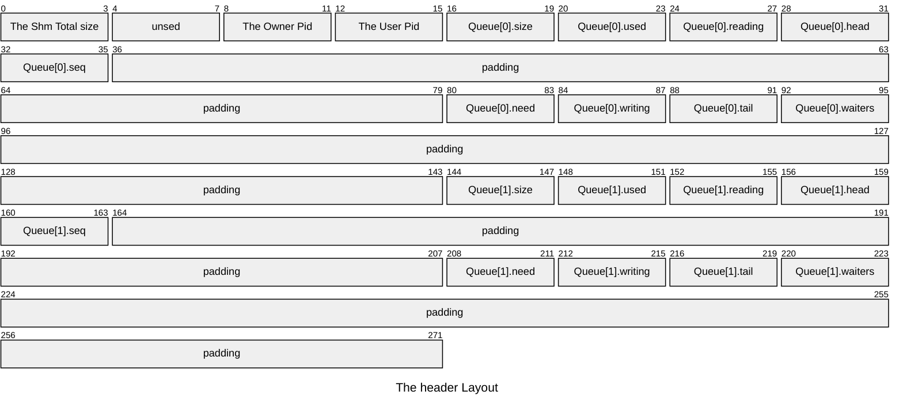

# kaze-core

`kaze-core` is the foundational component of the [kaze project](https://github.com/starwing/kaze), designed for high-performance, low-latency inter-process communication (IPC) double-end channel using shared memory.

## Features

* **Cross-Platform**: Supports Linux, macOS, and Windows.
* **High Performance**:
    * Utilizes futex (on Linux/macOS) or named Events (on Windows) for synchronization, minimizing overhead.
    * Achieves zero-syscall communication in the best-case scenario when queues are not contended and data/space is readily available.
* **Advanced Futex Usage (Linux)**: Employs `futex_waitv` (futex2) if available on Linux for efficient multiplexed waiting, falling back to standard futex syscalls otherwise.
* **Multiple Implementations**:
    * **C**: A pure C89 implementation (`kaze.h`) providing the core logic.
    * **Go**: A Go package (`kaze/kaze`) that provides a native Go version with a compatible shared memory layout.

## The Shared Memory Layout

`kaze-core` uses a shared memory segment meticulously structured for efficient communication between two processes (an "owner" and a "user"). The layout is defined by `kz_ShmHdr` in C and mirrored by `shmHdr` in Go.

The shared memory segment is organized as:
1. **Header**: `kz_ShmHdr` (272 bytes) containing metadata for the two communication queues.
2. **Queue 0 Data Buffer**: Immediately follows the header. Its size is `kz_ShmHdr.queues[0].size`.
3. **Queue 1 Data Buffer**: Immediately follows Queue 0's data buffer. Its size is `kz_ShmHdr.queues[1].size`.

For owner process, the Queue 0 is the write queue, and the Queue 1 is the read queue. For user process, it's the opposite. For both processes, `kz_wait()` waits on the `seq` variable of their write queue, and when they need to wake up the other process, they do so through the `seq` variable of their own read queue.

### The Header Layout



The header across 4 cacheline, to split `used`, `need` of each queue to separate cachelines.

### Field Descriptions

| Field Name | Description                                          |
| ---------- | ---------------------------------------------------- |
| size       | Total size of the shared memory segment. Maximum 4GB |
| owner_pid  | Process ID of the owner process                      |
| user_pid   | Process ID of the user process                       |

### Queue Info Structure (128 bytes each)

| Field    | Size | Description                          |
| -------- | ---- | ------------------------------------ |
| size     | 4    | Size of this queue buffer            |
| used     | 4    | Number of bytes used (-1 == closed)  |
| reading  | 4    | Whether queue is being read          |
| head     | 4    | Head position in queue               |
| seq      | 4    | Operation sequence index (see below) |
| padding1 | 44   | Padding (11 uint32)                  |
| need     | 4    | Number of bytes needed to write      |
| writing  | 4    | Whether queue is being written to    |
| tail     | 4    | Tail position in queue               |
| waiters  | 4    | Number of `kz_wait()` waiters        |
| padding2 | 48   | Padding (12 uint32_t)                |

The channel offer a `kz_wait()` API to wait whether the queue can read or write. it waits on the `used` of read queue and `need` of write queue if `futex_waitv` is existing.  If `futex_waitv` is absent (e.g. in macOS), it waits on the `seq` of the write queue. Each direction of queue will atomicly increase the `seq` of read queue after a read or write operation commited. In that way, the `kz_wait()` on the `seq` will be awaked and check whether the channel can be read or write.

## C API (`kaze.h`)

### Example

```c
// for echo process
int main(void) {
    // open a exist channel (as user)
    kz_State *S = kz_open("test", 0, 0);
    if (S == NULL) perror("kz_open");

    // start echo event loop
    while (!kz_isclosed(S)) {
        kz_Context rctx, wctx;
        char    *rbuf, *wbuf;
        size_t  rlen = 0, wlen = 0;
        int     r;

        // start a read operation
        r = kz_read(S, &rctx);
        // wait if necessary
        if (r == KZ_AGAIN) r = kz_waitcontext(&rctx, -1);
        // exit when the channel is closed
        if (r == KZ_CLOSED) break;
        assert(r == KZ_OK);
        // retrieve the result buffer of read operation
        rbuf = kz_buffer(&rctx, &rlen);

        // start a write operation (overlaps the read operaion)
        r = kz_write(S, &wctx, rlen);
        if (r == KZ_AGAIN) r = kz_waitcontext(&wctx, -1);
        if (r == KZ_CLOSED) break;
        assert(r == KZ_OK);
        // retrieve the data buffer of write operation
        wbuf = kz_buffer(&wctx, &wlen);
        assert(wlen >= rlen);
        // write readed result into write buffer
        memcpy(wbuf, rbuf, rlen);
        // commit both operation
        r = kz_commit(&rctx, rlen);
        assert(r == KZ_OK);
        r = kz_commit(&wctx, rlen);
        assert(r == KZ_OK);
    }
    kz_close(S);
    printf("echo thread exit\n");
    return 0;
}

// for client process
int main(void) {
    kz_State *S;
    kz_Thread t;
    int readcount = 0, writecount = 0, count = 100;
    int r;

    // create a channel as owner
    S = kz_open("test", KZ_CREATE, 1024);
    assert(S != NULL);
    
    // start send echo requests
    while (readcount < count || writecount < count) {
        kz_Context ctx;
        size_t buflen;
        char *buf;
        
        // wait for read or write (-1 means wait forever)
        r = kz_wait(S, 10, -1);
        assert(r > 0);
        
        // if can read
        if ((r & KZ_READ) && readcount < count) {
            r = kz_read(S, &ctx);
            buf = kz_buffer(&ctx, &buflen);
            assert(buflen == 10);
            assert(memcmp(buf, "helloworld", buflen) == 0);
            kz_commit(&ctx, buflen);
            readcount++;
        }
        
        // if can write
        if ((r & KZ_WRITE) && writecount < count) {
            r = kz_write(S, &ctx, 10);
            assert(r == KZ_OK);
            buf = kz_buffer(&ctx, &buflen);
            assert(buflen >= 10);
            memcpy(buf, "helloworld", 10);
            kz_commit(&ctx, 10);
            writecount++;
        }
    }
    printf("readcount=%d writecount=%d\n", readcount, writecount);
    // shutdown the channel, makes echo process exit.
    kz_shutdown(S, KZ_BOTH);
	// close the channel.
    kz_close(S);
    return 0;
}
```

The C API provides functions to manage and use these shared memory queues. Key data types:

* `kz_State`: An opaque structure representing the state of a kaze channel.
* `kz_Context`: An opaque structure representing the context of an ongoing read or write operation.

### Global Operations

* `KZ_API size_t kz_aligned(size_t bufsize, size_t pagesize);`
    * Calculates the system page-aligned `bufsize` for a given single direction queue size.
* `KZ_API int kz_exists(const char *name, int *powner, int *puser);`
    * Checks if a named queue exists. If it does, `*powner` and `*puser` are filled with the PIDs of the owner and user processes, respectively.
    * Returns `KZ_OK` if exists, `KZ_FAIL` otherwise.
* `KZ_API int kz_unlink(const char *name);`
    * Removes (unlinks) a named shared memory queue.
    * Returns `KZ_OK` on success or if not found, `KZ_FAIL` on error.
* `KZ_API const char *kz_failerror(void);`
    * Returns a string description of the last platform-specific error (e.g., from `errno` or `GetLastError()`).
* `KZ_API void kz_freefailerror(const char *s);`
    * Frees the error string returned by `kz_failerror`. (Platform-dependent: no-op on POSIX, `LocalFree` on Windows).

### Queue Creation/Destruction

* `KZ_API kz_State *kz_open(const char *name, int flags, size_t bufsize);`
    * Opens an existing queue or creates a new one.
    * `name`: A unique name for the shared memory queue.
    * `flags`: Combination of:
        * `KZ_CREATE`: Create the queue if it doesn't exist.
        * `KZ_EXCL`: With `KZ_CREATE`, fail if the queue already exists.
        * `KZ_RESET`: If creating, or if opening an existing queue and the current process is the owner, reset the queue state.
    * `bufsize`: The desired capacity for each of the two internal ring buffers. This size will be aligned. you can use `kz_aligned()` to calculate a buffer size for desired queue size. 
    * Returns a pointer to `kz_State` on success, `NULL` on failure.
* `KZ_API void kz_close(kz_State *S);`
    * Closes the kaze queue connection. Releases resources associated with `S`.
* `KZ_API int kz_shutdown(kz_State *S, int mode);`
    * Gracefully shuts down one or both directions of communication. Marks the respective queue(s) as closed and wakes up any waiting processes.
    * `mode`: `KZ_READ` (shutdown receiving), `KZ_WRITE` (shutdown sending), or `KZ_BOTH`.
    * Returns `KZ_OK` on success.

### Queue Info

* `KZ_API const char *kz_name(const kz_State *S);`
    * Returns the name of the queue.
* `KZ_API size_t kz_size(const kz_State *S);`
    * Returns the configured capacity of a single ring buffer in the queue pair.
* `KZ_API int kz_pid(const kz_State *S);`
    * Returns the PID of the current process as associated with this `kz_State`.
* `KZ_API int kz_isowner(const kz_State *S);`
    * Returns non-zero if the current process is the owner of the queue, 0 otherwise.
* `KZ_API int kz_isclosed(const kz_State *S);`
    * Returns non-zero if both directions of the queue are closed, 0 otherwise.

### Read/Write Operations

These functions use a `kz_Context` to manage multi-step, potentially non-blocking operations.

* `KZ_API int kz_read(kz_State *S, kz_Context *ctx);`
    * Initiates a read operation. Prepares `ctx` for reading.
    * Returns `KZ_OK` if data is immediately available, `KZ_AGAIN` if no data, `KZ_CLOSED` if closed, or other error codes.
* `KZ_API int kz_write(kz_State *S, kz_Context *ctx, size_t len);`
    * Initiates a write operation for `len` bytes. Prepares `ctx` for writing.
    * `len`: The number of bytes intended to be written.
    * Returns `KZ_OK` if space for `len` bytes is immediately available, `KZ_AGAIN` if not enough space, `KZ_TOOBIG` if `len` exceeds queue capacity, `KZ_CLOSED` if closed, or other error codes.
* `KZ_API int kz_isread(const kz_Context *ctx);`
    * Returns non-zero if `ctx` was initiated by `kz_read`, 0 if by `kz_write`.
* `KZ_API char *kz_buffer(kz_Context *ctx, size_t *plen);`
    * Gets a pointer to the internal buffer for reading data from or writing data into.
    * `*plen`: On entry for write, it's the requested write size. On exit, it's updated with the actual contiguous space available (for write) or data length available (for read).
    * Returns `NULL` if the context is invalid or the operation was not successful (e.g. `KZ_AGAIN`).
* `KZ_API int kz_commit(kz_Context *ctx, size_t len);`
    * Commits the read or write operation.
    * `len`: For read, unused value (can pass 0). For write, the number of bytes actually written to the buffer.
    * Updates queue pointers and wakes waiters if necessary.
    * Returns `KZ_OK` on success.
* `KZ_API void kz_cancel(kz_Context *ctx);`
    * Cancels an in-progress read/write operation initiated on `ctx`. Releases any internal locks/flags.

### Synchronization and Waiting

* `#define kz_wouldblock(ctx) ((ctx)->result == KZ_AGAIN)`
    * A macro to check if the last operation on `ctx` (e.g., `kz_read`, `kz_write`) returned `KZ_AGAIN`, indicating it would block if it were a blocking call.
* `KZ_API int kz_wait(kz_State *S, size_t len, int millis);`
    * Waits until either `len` bytes can be written to the send queue OR any data is available in the receive queue.
    * `millis`: Timeout in milliseconds. `<0` for infinite, `0` for non-blocking check.
    * Returns `KZ_READ`, `KZ_WRITE` or `KZ_BOTH` (all positive) if condition met, `KZ_TIMEOUT`, `KZ_CLOSED`, or `KZ_FAIL` (all negative) if any error occurs.
* `KZ_API int kz_waitcontext(kz_Context *ctx, int millis);`
    * Waits for the specific operation previously initiated on `ctx` (either read or write) to become possible.
    * `millis`: Timeout in milliseconds.
    * Returns `KZ_OK` if the operation can proceed, `KZ_TIMEOUT`, `KZ_CLOSED`, or `KZ_FAIL` otherwise. After `KZ_OK`, you typically retry the `kz_buffer` / `kz_commit` sequence.

Return codes like `KZ_OK`, `KZ_AGAIN`, `KZ_CLOSED`, `KZ_TIMEOUT`, `KZ_FAIL`, `KZ_TOOBIG`, `KZ_BUSY`, `KZ_INVALID` are used throughout the API to indicate operation status.
